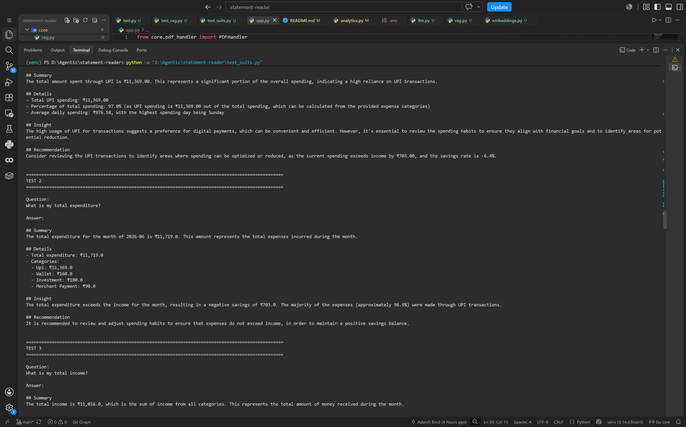

# 💰 Khatalyse AI - Financial Document Intelligence Engine

> An end-to-end AI-powered financial document analysis platform that transforms bank statements into actionable insights using Large Language Models (LLMs), Retrieval-Augmented Generation (RAG), and semantic search.

---

## 🚀 Overview

Khatalyse AI enables users to upload bank statements in PDF format and receive:

- 📊 Financial analytics
- 💡 AI-generated spending insights
- ⚠️ Risk analysis
- 🎯 Personalized recommendations
- 💬 Conversational Q&A over financial documents using RAG

The project combines modern AI techniques with a production-ready backend to build an intelligent financial assistant.

---

## ✨ Features

- Secure PDF Upload & Processing
- Password-Protected PDF Support
- Intelligent Bank Statement Parsing
- Transaction Normalization
- Financial KPI Generation
- Spending & Income Analysis
- Merchant & Category Analytics
- AI Insight Generation
- Financial Risk Detection
- Personalized Recommendations
- Semantic Search using Vector Embeddings
- Retrieval-Augmented Generation (RAG)
- Natural Language Chat Interface
- REST APIs with FastAPI

---

## 🏗️ System Architecture

```text
                 PDF Upload
                      │
                      ▼
             PDF Decryption
                      │
                      ▼
             LlamaParse Parser
                      │
                      ▼
          Structured JSON Output
                      │
                      ▼
         Financial Analytics Engine
                      │
          ┌───────────┼───────────┐
          ▼           ▼           ▼
     Insights      Risk AI   Recommendations
          │
          ▼
     Embedding Generator
          │
          ▼
      FAISS Vector Store
          │
          ▼
       Retriever Engine
          │
          ▼
      Groq LLM + RAG
          │
          ▼
      Intelligent Chat
```

---

# 🛠 Tech Stack

### AI / Machine Learning

- Groq LLM
- LlamaParse
- Sentence Transformers
- FAISS
- Retrieval-Augmented Generation (RAG)

### Backend

- FastAPI
- Python
- Pydantic

### Data Processing

- Pandas
- NumPy

### Infrastructure

- Docker
- Git
- GitHub

---

# 📂 Project Structure

```
app/
│
├── api/
│   ├── upload.py
│   ├── analyze.py
│   ├── dashboard.py
│   └── chat.py
│
├── services/
│   ├── pdf_handler.py
│   ├── parser.py
│   ├── analytics.py
│   ├── insights.py
│   ├── risk_engine.py
│   ├── recommendation_engine.py
│   ├── embeddings.py
│   ├── vector_store.py
│   ├── retriever.py
│   └── rag.py
│
├── models/
│
└── main.py
```

---

# 🔥 AI Pipeline

1. Upload Bank Statement
2. PDF Parsing
3. Transaction Extraction
4. Financial Analytics
5. Insight Generation
6. Risk Assessment
7. Recommendation Engine
8. Embedding Generation
9. Vector Database Indexing
10. Retrieval-Augmented Generation
11. Conversational AI

---

# 📈 Example Queries

- How much did I spend on food?
- What was my biggest expense?
- Who received the largest payment?
- What are my spending habits?
- Which category consumes most of my income?
- Am I at financial risk?
- Give me recommendations to improve my savings.

---
# Chat Screen Demo



---

# 🎯 Key Capabilities

- End-to-End AI Application
- Financial Document Intelligence
- LLM Integration
- Retrieval-Augmented Generation
- Semantic Search
- Production-ready FastAPI Backend
- Financial Analytics Engine
- AI-powered Decision Support

---

# 🚀 Future Improvements

- Multi-bank Support
- Dashboard Visualization
- OCR for Scanned Statements
- Multi-document Chat
- Agentic Financial Assistant
- Budget Forecasting
- Fine-tuned Financial LLM

---

# 👨‍💻 Author

**Adarsh Bind**

- GitHub: https://github.com/Adarshninja
- LinkedIn: https://linkedin.com/in/adarshninja

---

## ⭐ If you found this project interesting, consider giving it a star!