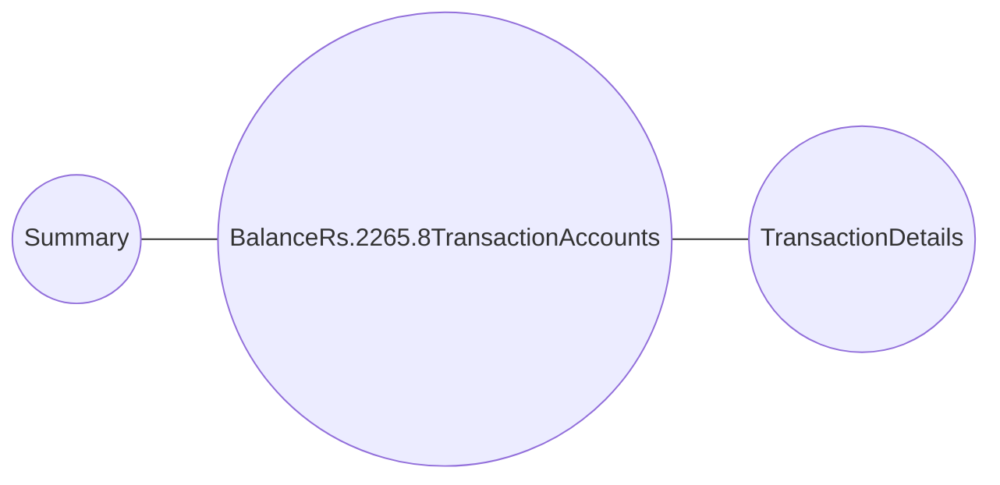

SBI logo

Welcome Mr. Adarsh Bind
Customer XXXXXXX2004

# Relationship Summary

As on 30-06-26

<table>
  <tbody>
    <tr>
        <td>Summary</td>
<td>Balance Rs.2265.8 Transaction Accounts</td>
<td>Transaction Details</td>
    </tr>
  </tbody>
</table>

* User icon **My Name**: Mr. Adarsh Bind

* Location icon **My Address**: S/O: Rambabu Bind Mohanpur (Kushaha),,DIST Jigna,Mirzapur,UTTAR PRADESH-231313.

## MY INFORMATION

* Email icon **Email ID**: adXXXXXXXXXXXXX@gmail.com
* Mobile icon **Mobile Number**: 84XXXXXX23
* PAN icon **PAN**: GOXXXXX00P
* Segment icon **Segment**: GOLD
* Toll Free icon **Toll Free Number**: 1800 11 22111800 1234
* KYC icon **KYC Status**: Compliant

## MY HOME BRANCH INFORMATION

* Home Branch icon **Home Branch**: CHHANBEY (VIJAYPUR)
* Branch Code icon **Branch Code**: 15131
* Branch Email icon **Branch Email ID**: sbi.15131@sbi.co.in
* Branch Phone icon **Branch Phone Number**: 05442-281220

PLEASE DO NOT SHARE YOUR ATM, DEBIT/CREDIT CARD NUMBER, PIN AND OTP WITH ANYONE ELSE. BANK NEVER ASKS FOR SUCH INFORMATION.

## MY ACCOUNTS

<table>
  <thead>
    <tr>
        <th rowspan="2">Deposit Accounts</th>
        <th rowspan="2">Currency</th>
        <th colspan="2">No. of Accounts</th>
        <th colspan="2" rowspan="2">Available Balance</th>
    </tr>
<tr>
        <th>Primary</th>
        <th colspan="2">Secondary</th>
    </tr>
  </thead>
  <tbody>
    <tr>
        <td>Transaction Accounts*</td>
<td>SAVING ACCOUNT</td>
<td>INR</td>
<td>1</td>
<td>0</td>
<td>2265.88</td>
    </tr>
<tr>
        <td colspan="2">Total</td>
        <td colspan="3">INR: Rs. 2265.88</td>
<td></td>
    </tr>
  </tbody>
</table>

\*Each depositor is insured by the Deposit Insurance and Credit Guarantee Corporation(DICGC) upto the maximum of Rs. 5 Lakh, for both principal and interest amount held by him in the same right and same capacity.

Advertisement for Yono SBI app featuring a family and the text: Jitne apps, utne jhanjhat. Uninstall the jhanjhats. yono Lifestyle & banking, dono. Download & Register now | yonosbi.com. SHOPPING | INVESTMENTS | BANKING | TICKETS | FOOD | MORE

Visit https://sbi.co.in Customer Care Number : 1800 1234 Customer Care Email : customercare@sbi.co.in 1 of 4

---

SBI logo

Welcome Mr. Adarsh Bind
Customer XXXXXXX2004

# Relationship Summary

As on 30-06-26

<table>
  <tbody>
    <tr>
        <td>Summary</td>
<td>Balance Rs.2265.8 Transaction Accounts</td>
<td>Transaction Details</td>
    </tr>
  </tbody>
</table>

## TRANSACTION ACCOUNTS

## SAVINGS ACCOUNTS

<table>
  <thead>
    <tr>
        <th>Holding Status</th>
        <th>Mode Of Operation</th>
        <th>Account Number</th>
        <th>Account Status</th>
        <th>Currency</th>
        <th>Current Balance</th>
        <th>Lien/Hold Amount</th>
        <th>MOD** Balance</th>
        <th>Available Balance</th>
    </tr>
  </thead>
  <tbody>
    <tr>
        <td>P</td>
<td>SINGLE</td>
<td>XXXXXXX2040</td>
<td>OPEN</td>
<td>INR</td>
<td>2265.88</td>
<td>0.00</td>
<td>0.00</td>
<td>2265.88</td>
    </tr>
  </tbody>
</table>

\*MOD: Multi Option Deposit

\* P – Primary Account Holder

\*S – Secondary Account Holder

SBI Card advertisement: SimplyCLICK SBI Card. For a generation that's always online. APPLY NOW.

Visit https://sbi.co.in Customer Care Number : 1800 1234 Customer Care Email : customercare@sbi.co.in 2 of 4

---

SBI Logo

Welcome Mr. Adarsh Bind
Customer XXXXXXX2004

# Relationship Summary

Calendar icon As on 30-06-26

## TRANSACTION DETAILS

### SAVING ACCOUNT
### XXXXXXX2040

<table>
  <tbody>
    <tr>
        <td>Name of the Account Holder</td>
<td>Mr. Adarsh Bind</td>
    </tr>
<tr>
        <td>Address</td>
<td>S/O: Rambabu Bind Mohanpur (Kushaha),,DIST-Jigna,Mirzapur,UTTAR PRADESH-231313.</td>
    </tr>
<tr>
        <td>Mode of Operation</td>
<td>SINGLE</td>
    </tr>
<tr>
        <td>Branch Name</td>
<td>CHHANBEY (VIJAYPUR)</td>
    </tr>
<tr>
        <td>Branch Code</td>
<td>15131</td>
    </tr>
<tr>
        <td>MICR Code</td>
<td>231002058</td>
    </tr>
<tr>
        <td>IFSC Code</td>
<td>SBIN0015131</td>
    </tr>
<tr>
        <td>Nominee Registered</td>
<td>Yes</td>
    </tr>
<tr>
        <td>Available Balance</td>
<td>2265.88</td>
    </tr>
<tr>
        <td>Multi-Option Deposit Balance</td>
<td>0.00</td>
    </tr>
  </tbody>
</table>

## TRANSACTION OVERVIEW

<table>
  <thead>
    <tr>
        <th>Date</th>
        <th>Transaction Reference</th>
        <th>Ref.No./Chq.No.</th>
        <th>Credit</th>
        <th>Debit</th>
        <th>Balance</th>
    </tr>
  </thead>
  <tbody>
    <tr>
        <td colspan="2">Your Opening Balance on 01-06-26:</td>
<td>₹ 2968.88</td>
<td> </td>
<td> </td>
<td> </td>
    </tr>
<tr>
        <td>01-06-26</td>
<td>UPI/DR/615286927333/Lakshmi /AIRP/o111172582/Payme</td>
<td>-</td>
<td>0</td>
<td>10.00</td>
<td>2958.88</td>
    </tr>
<tr>
        <td>02-06-26</td>
<td>UPI/DR/786546597680/REETA DEVI/PUNB/8009834334/Pay</td>
<td>-</td>
<td>0</td>
<td>50.00</td>
<td>2908.88</td>
    </tr>
<tr>
        <td>02-06-26</td>
<td>UPI/DR/615394275639/Abhishek/NSPB/9936717425/Paid</td>
<td>-</td>
<td>0</td>
<td>20.00</td>
<td>2888.88</td>
    </tr>
<tr>
        <td>03-06-26</td>
<td>UPI/DR/615499524657/Shyam La/YESB/paytm.s25v/Paid</td>
<td>-</td>
<td>0</td>
<td>20.00</td>
<td>2868.88</td>
    </tr>
<tr>
        <td>04-06-26</td>
<td>UPI/DR/675154515921/PRATIMA /SBIN/8574655936/Payme</td>
<td>-</td>
<td>0</td>
<td>1.00</td>
<td>2867.88</td>
    </tr>
<tr>
        <td>06-06-26</td>
<td>UPI/DR/615727079417/KASHISH/IPOS/8887857278/Paid v</td>
<td>-</td>
<td>0</td>
<td>10.00</td>
<td>2857.88</td>
    </tr>
<tr>
        <td>09-06-26</td>
<td>UPI/DR/103450104389/MUTUAL F/HDFC/groww.iccl/India</td>
<td>-</td>
<td>0</td>
<td>100.00</td>
<td>2757.88</td>
    </tr>
<tr>
        <td>10-06-26</td>
<td>UPI/DR/616171045756/Yogendra/BARB/q437265750/Paid</td>
<td>-</td>
<td>0</td>
<td>15.00</td>
<td>2742.88</td>
    </tr>
<tr>
        <td>10-06-26</td>
<td>UPI/DR/616171090557/Amit Pra/YESB/paytm.s1ji/Paid</td>
<td>-</td>
<td>0</td>
<td>40.00</td>
<td>2702.88</td>
    </tr>
<tr>
        <td>11-06-26</td>
<td>UPI/DR/616275649170/Mr Akash/IDIB/akashyadav/Paid</td>
<td>-</td>
<td>0</td>
<td>750.00</td>
<td>1952.88</td>
    </tr>
<tr>
        <td>11-06-26</td>
<td>UPI/DR/616277413749/FINZOOM /INDB/FINZOOMINV/UPIIn</td>
<td>-</td>
<td>0</td>
<td>187.00</td>
<td>1765.88</td>
    </tr>
<tr>
        <td>16-06-26</td>
<td>UPI/CR/214626293608/GEETA DEVI/PUNB/8381829661/Pay</td>
<td>-</td>
<td>100.00</td>
<td>0</td>
<td>1865.88</td>
    </tr>
<tr>
        <td>20-06-26</td>
<td>UPI/CR/070895215839/RAMBABU /PUNB/udevi0022@/Payme</td>
<td>-</td>
<td>10000.00</td>
<td>0</td>
<td>11865.88</td>
    </tr>
<tr>
        <td>20-06-26</td>
<td>UPI/DR/077824116158/Mr USHA /IDIB/9936129539/Payme</td>
<td>-</td>
<td>0</td>
<td>1.00</td>
<td>11864.88</td>
    </tr>
<tr>
        <td>20-06-26</td>
<td>UPI/DR/340673861998/Yogendra/BARB/Q437265750/Payme</td>
<td>-</td>
<td>0</td>
<td>200.00</td>
<td>11664.88</td>
    </tr>
<tr>
        <td>20-06-26</td>
<td>UPI/CR/294031012296/REETA DEVI/PUNB/8009834334/Pay</td>
<td>-</td>
<td>300.00</td>
<td>0</td>
<td>11964.88</td>
    </tr>
<tr>
        <td>20-06-26</td>
<td>UPI/DR/494941851607/Sunita/YESB/BHARATPE09/Pay To</td>
<td>-</td>
<td>0</td>
<td>90.00</td>
<td>11874.88</td>
    </tr>
<tr>
        <td>20-06-26</td>
<td>UPI/CR/493218799733/REETA DEVI/PUNB/8009834334/Pay</td>
<td>-</td>
<td>100.00</td>
<td>0</td>
<td>11974.88</td>
    </tr>
  </tbody>
</table>

Visit https://sbi.co.in

Customer Care Number : 1800 1234

Customer Care Email : customercare@sbi.co.in

3 of 4

---

SBI Relationship Summary logo

Welcome Mr. Adarsh Bind
Customer XXXXXXX2004

Calendar icon As on 30-06-26

# Relationship Summary

<table>
  <thead>
    <tr>
        <th>Date</th>
        <th>Transaction Reference</th>
        <th>Ref.No./Chq.No.</th>
        <th>Credit</th>
        <th>Debit</th>
        <th>Balance</th>
    </tr>
  </thead>
  <tbody>
    <tr>
        <td>20-06-26</td>
<td>UPI/DR/201047967671/Amit Pra/YESB/paytm.s1ji/NO RE</td>
<td>-</td>
<td>0</td>
<td>100.00</td>
<td>11874.88</td>
    </tr>
<tr>
        <td>21-06-26</td>
<td>UPI/DR/065601754626/ADARSH B/PUNB/8423356323/Payme</td>
<td>-</td>
<td>0</td>
<td>10000.00</td>
<td>1874.88</td>
    </tr>
<tr>
        <td>25-06-26</td>
<td>INTEREST CREDIT</td>
<td>-</td>
<td>105.00</td>
<td>0</td>
<td>1979.88</td>
    </tr>
<tr>
        <td>26-06-26</td>
<td>UPI/DR/572633233011/95552103/AIRP/9555210373/Payme</td>
<td>-</td>
<td>0</td>
<td>100.00</td>
<td>1879.88</td>
    </tr>
<tr>
        <td>28-06-26</td>
<td>UPI/CR/617917041260/MEESHO T/YESB/mtpl1@yesb/CT223</td>
<td>-</td>
<td>407.00</td>
<td>0</td>
<td>2286.88</td>
    </tr>
<tr>
        <td>29-06-26</td>
<td>UPI/CR/103554164048/NPCI BHIM/HDFC/bhimcashba/BHIM</td>
<td>-</td>
<td>4.00</td>
<td>0</td>
<td>2290.88</td>
    </tr>
<tr>
        <td>30-06-26</td>
<td>UPI/DR/213043659591/RAJESH K/IPOS/9936075171/NO RE</td>
<td>-</td>
<td>0</td>
<td>25.00</td>
<td>2265.88</td>
    </tr>
<tr>
        <td colspan="5">Your Closing Balance on 30-06-26:</td>
<td>₹ 2265.88</td>
    </tr>
  </tbody>
</table>

\*All dates are in DD-MM-YY format

\> Contents of this statement will be considered correct if no error is reported within 30 days of receipt of the statement.

Visit https://sbi.co.in

Customer Care Number : 1800 1234

Customer Care Email : customercare@sbi.co.in

4 of 4
